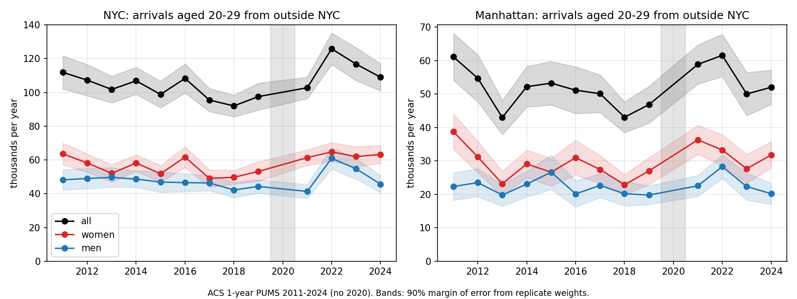
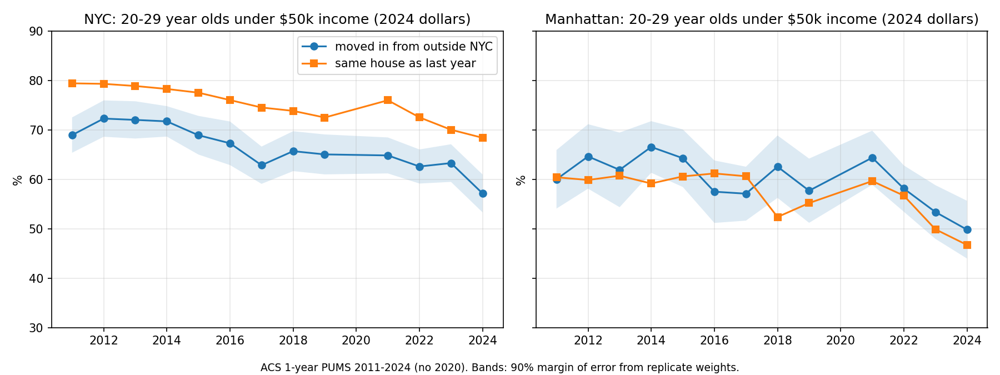
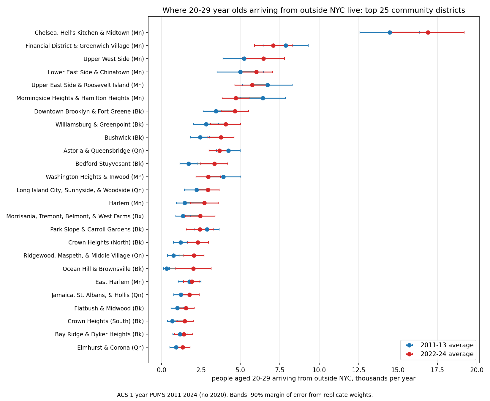

# Are fewer young people moving to New York?

Working repo for an article testing two claims: that fewer people in their twenties move to New York City (and Manhattan in particular) each year than in the early 2010s, and that the drop is concentrated among lower earners. Nothing here is settled. Three sources are in: Census population estimates (net migration by age), IRS tax-return address changes (gross arrivals by income), and the American Community Survey microdata (arrivals by age, sex, income and neighborhood).

Where the three land:

| | Fewer young arrivals? | Fewer low-earning young arrivals? |
|---|---|---|
| Census estimates (net, by age) | No: Manhattan gained more 20-24 year olds by net migration in 2020-25 than in 2010-15 | can't say |
| IRS returns (gross, by AGI) | Yes, 2012 to 2020: 20% fewer returns arriving in Manhattan, 20% fewer under-26 filers arriving in the state | Yes: under-26 arrivals under $50k fell 35% in the state, and 7 points more than residents' wage growth explains |
| ACS microdata (gross, by age, income, neighborhood) | No for the city (112k a year in 2011, 109k in 2024, both ±9k). Manhattan 61k to 52k, at the edge of the margin of error | Yes: arrivals aged 20-29 under $50k in 2024 dollars fell 19% citywide and 29% in Manhattan; young residents' incomes rose about as much |

So the first claim is weak and the second holds in the two sources that can test it, with the caveat that young people already living here got richer at nearly the same pace. Where the young arrivals live has shifted: Brooklyn's share is up (Bed-Stuy, Harlem and Crown Heights North nearly doubled, Bushwick up half), and Morningside Heights, Washington Heights and the Upper East Side are down.

## Source 1: Census population estimates

The Census Bureau's county population estimates (PEP) give the population of each borough by age and sex every July. A group that is 20-24 in one year is 25-29 five years later, and almost nobody that age dies, so the change in that group's size is net migration. This is not survey-based, so it does not depend on young people answering the ACS.

Result: the estimates do **not** show fewer young adults arriving. For women aged 20-24 in Manhattan, net gain over the following five years:

| 5-year window | Net gain, women 20-24 at start | Series |
|---|---|---|
| 2010 to 2015 | +27,500 | 2010-base estimates |
| 2015 to 2020 | +34,200 | 2010-base estimates |
| 2020 to 2025 | +35,700 | 2020-base estimates |

Citywide the same window went from +74,600 to +74,900 to +92,800. Men look the same. Year by year since 2020, Manhattan gained 13,000 to 20,000 people aged 20-28 a year from 2022 to 2024 and 9,000 in 2025 (fig 2). The 2025 slowdown is one data point.


## Why this is not the end of the question

1. **The 2010s estimates missed young women in Manhattan.** The 2010-base series put women 20-24 in Manhattan at 61,100 in July 2020; the 2020 census-based series put the same group at 77,600, 27% higher (fig 3). The 2010s series was carried forward from the 2010 census with administrative data and drifted low. That means the 2010s cohort gains in the table above are probably *understated*, which would narrow the gap between then and now, not widen it. It also means the two series should not be joined into one line.
2. **The 2020 census itself had a college-age problem.** It was taken in April 2020, when students had left campuses. How the Bureau handled that affects the 2020-base series' starting point for exactly this age group.
3. **This is net, not gross.** More people arriving and more people leaving would look the same as no change. Only IRS flows and ACS can separate arrivals from departures.
4. **Nothing here says anything about income.** The low-earner claim needs IRS county-to-county flows by AGI band and ACS PUMS by personal income.


## Source 2: IRS tax-return address changes

The IRS Statistics of Income migration files count tax returns whose filing address moved from one county to another between two filing years, with the number of people on the return and the return's AGI. This is a count of arrivals, not net change, and it covers everyone who files, which is most adults but not students with no income or people paid off the books. The county files carry no age. The state files carry age of the filer and AGI band, so the age-by-income test can only be run for New York State as a whole.

Returns moving into Manhattan from outside the five boroughs, and into the five boroughs from outside the city:

| Filing year pair | Into Manhattan | Into NYC | Into NY State, filer under 26 | of which AGI under $50k |
|---|---|---|---|---|
| 2011-12 | 49,200 | 127,700 | 40,500 | 89% |
| 2014-15 | 38,900 | 97,800 | 34,300 | 83% |
| 2016-17 | 52,000 | 126,000 | 37,700 | 78% |
| 2019-20 | 39,600 | 105,000 | 32,400 | 72% |
| 2020-21 | 42,300 | 106,000 | 30,000 | 69% |
| 2021-22 | 59,300 | 133,500 | 42,900 | 61% |
| 2022-23 | 65,500 | 148,500 | 59,500 | 64% |

Full series in `output/tables/irs_inflows_manhattan_nyc.csv` and `output/tables/irs_ny_under26_by_agi.csv`.


Three things stop this from being an answer:

1. **2022-23 is a different series.** The IRS says that starting with the 2022-23 data it changed how it matches returns across years. Nationally, in-moving returns with a filer under 26 went from 690,000 in 2020-21 to 970,000 in 2022-23, a 40% jump that is not a real migration wave. The 2022-23 column should not be compared with earlier years, and 2021-22 is the first year of post-pandemic return, so the clean comparison is 2011-12 against 2019-20, the last pre-pandemic year: 20% fewer returns arriving in Manhattan, 18% fewer in the city, and 20% fewer under-26 filers arriving in the state.
2. **The AGI bands are in nominal dollars.** $50,000 in 2012 is about $66,000 in 2023 dollars, so a filer on the same real wage moved up roughly one band, and the IRS does not publish bands by age in constant dollars. The fix is to compare groups that faced the same inflation. Under-26 filers who already lived in New York went from 92% under $50k in 2012 to 82% in 2020; under-26 filers moving *into* New York went from 89% to 72%. The 10-point fall for residents is wages; the extra 7 points for arrivals is a change in who arrives. The same in-mover-minus-resident gap for every other state widened by only 2.5 points (93% to 83% for arrivals, 94% to 87% for residents), so this is a New York pattern, not a national one. In counts, under-26 arrivals to the state with AGI under $50k fell from 35,900 to 23,300 (35%) while all under-26 arrivals fell 20%. Table in `output/tables/irs_under26_low_agi_shares.csv`.
3. **Returns are not people, and filers are not the 20-28 cohort.** A return arriving in Manhattan carried 1.31 people in 2012 and 1.17 in 2023 (fig 4, gap between the lines), so the number of people arriving fell a little faster than the number of returns: 22% for Manhattan over 2012-2020 against 20% in returns. The under-26 age group is the filer's age, and dependents on a parent's return don't appear at all.


## Source 3: American Community Survey microdata

The ACS asks where each person lived a year ago. The public microdata (PUMS) has age, sex, personal income and the respondent's PUMA, which in New York is a community district, so this is the only source that can count arrivals aged 20-29 by income and by neighborhood. It is a 1% sample: about 900 to 1,100 records a year for young arrivals citywide and 300 to 560 for Manhattan, so every number below has a margin of error, shown at 90%. Young renters answer the survey less than most people, and the Bureau's weights push the totals to the same population estimates as Source 1, so the two are not independent.

People aged 20-29 who lived outside the five boroughs a year earlier (including abroad), and the number of them with personal income under $50,000 in 2024 dollars:

| Year | Into NYC | under $50k | Into Manhattan | under $50k |
|---|---|---|---|---|
| 2011 | 111,900 ± 9,800 | 77,200 (69%) | 61,100 ± 7,000 | 36,700 (60%) |
| 2019 | 97,500 ± 8,000 | 63,500 (65%) | 46,800 ± 5,500 | 27,000 (58%) |
| 2024 | 109,000 ± 8,000 | 62,300 (57%) | 52,000 ± 5,100 | 25,900 (50%) |

Full series by year and sex in `output/tables/pums_inmovers_20_29.csv` and `pums_inmovers_20_29_by_sex.csv`.



What it says:

1. **Total young arrivals are flat citywide.** 2011 and 2024 are inside each other's margins of error. The late 2010s (2017-2019) were lower, about 95,000 a year, and 2022 was the highest year in the series at 126,000. Manhattan drifted from 61,000 to 47,000 by 2019 and came back to 52,000; 2011 against 2024 is a 15% drop with a margin of about the same size. Women outnumber men among young arrivals every year, roughly 60/40 in Manhattan (fig 7).
2. **Low-income young arrivals fell, in real dollars.** Citywide, arrivals aged 20-29 with income under $50,000 in 2024 dollars went from 77,000 to 62,000 (19%); in Manhattan from 37,000 to 26,000 (29%). Both drops clear the margin of error. Their share of arrivals fell from 69% to 57% citywide and 60% to 50% in Manhattan. This is the same direction as the IRS state-level result, now measured for Manhattan itself and after inflation.
3. **But young people who didn't move got richer almost as fast.** The under-$50k share among 20-29 year olds living in the same house as a year earlier fell from 79% to 68% citywide and 60% to 47% in Manhattan (fig 8). In Manhattan arrivals and stayers have the same income mix at both ends of the period. So this is not arrivals being filtered harder than residents; it is the whole age group in the city earning more, or the lower-earning part of it leaving and not being replaced. The IRS gap between arrivals and residents (Source 2, point 2) does not show up here for Manhattan, which is worth taking seriously: the IRS counts filers and the ACS counts people, and the two can disagree about the same city.



### Which neighborhoods

Average arrivals aged 20-29 per year by community district, pooling three years at a time to get the margins down. The two PUMA vintages (2010, used through the 2021 ACS; 2020, used from 2022) are matched on community district; Manhattan CDs 4, 5 and 6 are pooled because the vintages split them differently. Full table with margins and sample sizes in `output/tables/pums_neighborhoods.csv`.

| Manhattan community district | 2011-13 | 2022-24 | change | under $50k, 2011-13 | under $50k, 2022-24 |
|---|---|---|---|---|---|
| Chelsea, Hell's Kitchen & Midtown (CD 4-6) | 14,500 | 16,900 ± 2,300 | +17% | 59% | 44% |
| Financial District & Greenwich Village (CD 1-2) | 7,900 | 7,100 ± 1,200 | -10% | 51% | 47% |
| Upper West Side (CD 7) | 5,200 | 6,500 ± 1,300 | +23% | 58% | 52% |
| Lower East Side & Chinatown (CD 3) | 5,000 | 6,000 ± 1,000 | +20% | 65% | 60% |
| Upper East Side (CD 8) | 6,700 | 5,800 ± 1,100 | -14% | 53% | 49% |
| Morningside Heights & Hamilton Heights (CD 9) | 6,400 | 4,700 ± 850 | -27% | 86% | 79% |
| Washington Heights & Inwood (CD 12) | 3,900 | 3,000 ± 770 | -25% | 68% | 67% |
| Harlem (CD 10) | 1,500 | 2,700 ± 880 | +85% | 66% | 68% |
| East Harlem (CD 11) | 1,800 | 1,900 ± 520 | +7% | 68% | 72% |

By borough, arrivals per year went Manhattan 52,900 to 54,500, Brooklyn 23,900 to 32,800, Queens 20,200 to 19,700, Bronx 8,200 to 8,700, Staten Island 1,700 to 1,500. The Brooklyn gain is Downtown/Fort Greene, Williamsburg/Greenpoint, Bushwick (+54%), Bed-Stuy (+94%), Crown Heights North (+90%) and Ocean Hill/Brownsville (from 300 to 2,000, wide margin). The biggest falls are outer-borough districts that were never big destinations: Canarsie, Flushing, Sunset Park, Fresh Meadows, Riverdale, all roughly halved from a base of 600 to 2,300 a year.

In Manhattan the picture is a shift downtown and toward Midtown, and away from the two uptown districts that used to take the poorest arrivals. Morningside/Hamilton Heights (Columbia and City College territory, 86% of arrivals under $50k in 2011-13) lost a quarter of its young arrivals; Midtown/Chelsea gained a sixth and its under-$50k share fell 15 points, the largest fall of any Manhattan district. Harlem's gain comes with no change in the income mix. The neighborhood cells are small (58 to 395 sample records per district over three years) and a single district's change is rarely outside its margin; the pattern across districts is more reliable than any one row.



## Sources and files

| Source | Years | Age detail | File |
|---|---|---|---|
| PEP vintage 2020, county by age and sex | 2010-2020 | 5-year groups | `data/raw/CC-EST2020-AGESEX-36.csv` |
| PEP vintage 2025, county by age and sex | 2020-2025 | 5-year groups | `data/raw/CC-EST2025-AGESEX-36.csv` |
| PEP vintage 2025, county by single year of age and sex | 2020-2025 | single year | `data/raw/cc-est2025-syasex-36.csv` |

| IRS SOI county inflows | filing years 2011-12 to 2022-23 | none | `data/raw/irs/countyinflowYYYY.csv` |
| IRS SOI state inflows by AGI band and filer age | filing years 2011-12 to 2022-23 | under 26, 26-34, 35-44, ... | `data/raw/irs/YYYYinmigall.csv` |
| ACS 1-year PUMS, New York State persons, via Census API | 2011-2024, no 2020 | single year | `data/raw/pums/pums_YYYY.parquet` |
| PUMA names for NYC, both vintages | 2010, 2020 | | `data/puma_names_nyc.csv` |

Single year of age by county is not published for 2010-2019, in bulk files or the API (`pep/charage` stops at state level; `pep/charagegroups` gives counties in 5-year groups). So the annual series starts in 2021 and the 2010s rest on 5-year windows. The Census API key (`CENSUS_API_KEY`, free at api.census.gov) is needed for the PUMS download. Raw IRS and PUMS files are not committed (about 350 MB); the fetch scripts rebuild them.

## Run it

```
pip install -r requirements.txt
python src/fetch_pep.py       # downloads the three CSVs above (skips ones present)
python src/cohort_method.py   # writes data/processed/{levels,five_year_cohort,annual_cohort}.csv
python src/figures.py         # writes output/figures/fig1..fig3
python src/fetch_irs.py       # downloads 24 IRS CSVs into data/raw/irs (skips ones present)
python src/irs_flows.py       # writes data/processed/irs_*.csv, prints the tables above
python src/irs_figures.py     # writes output/figures/fig4..fig6 and output/tables/irs_*.csv
CENSUS_API_KEY=... python src/fetch_pums.py   # 13 years of NY PUMS with replicate weights, ~30 min
python src/pums_movers.py     # writes data/processed/pums_*.csv, prints the tables above
python src/pums_figures.py    # writes output/figures/fig7..fig9 and output/tables/pums_*.csv
```

## Method notes

- `five_year_cohort.csv`: for each borough, NYC total, sex and start year, `net_migration = pop(next 5-year group, start+5) - pop(group, start)`. Computed within one estimate series only; no window straddles the 2020 break.
- `annual_cohort.csv`: for ages 20-28 in year t, `net = sum over a of pop(a, t) - pop(a-1, t-1)`. Single-year data, 2021-2025.
- Deaths are ignored. At ages 20-29 the death rate is roughly 1 per 1,000 a year, under 1% over five years.
- Year codes: vintage 2020 file, code 2 = July 2010 through code 12 = July 2020; vintage 2025 file, code 2 = July 2020 through code 7 = July 2025. Base-population rows (April 1) are dropped.
- `irs_county_inflows.csv`: for each borough, `inflow_returns` = the IRS "Total Migration-US and Foreign" row (`y1_statefips` 96) minus rows whose origin is one of the other four boroughs. NYC = sum of the five. A year label of 2023 means the 2022-23 file (address in filing year 2023 differs from filing year 2022). The 2020-21 and 2021-22 files ship FIPS codes without leading zeros; the parser pads them.
- `irs_ny_state_inflow_age_agi.csv`: New York State rows of the `inmigall` files, columns `inflow_n1_<age>` by `agi_stub`. Age code 1 = filer under 26, 2 = 26-34. AGI stubs: 1 = $1-10k, 2 = $10-25k, 3 = $25-50k, 4 = $50-75k, 5 = $75-100k, 6 = $100-200k, 7 = $200k+; stub 0 (all) also includes returns with AGI of zero or less.
- Mean AGI in `irs_county_inflows.csv` is deflated to 2023 dollars with annual CPI-U (fig 5). It is dominated by a small number of very high incomes and is not used in the write-up.
- `pums_yearly.csv`: an arrival is `MIG == 2` (lived abroad a year ago) or `MIG == 3` (different house in the US) with residence a year ago not in one of the five NYC MIGPUMAs (3700/3800/3900/4000/4100 in the 2010 vintage, 4100-4500 in the 2020 vintage). A stayer is `MIG == 1`. Income is `PINCP` in the survey year's dollars, converted to 2024 dollars with annual CPI-U. Standard errors use the 80 replicate weights: `SE^2 = 4/80 * sum((rep - full)^2)`; MOE is 1.645 SE. The 2011 ACS uses 2000-vintage PUMAs, which in NYC carry the same codes and community-district boundaries as the 2010 vintage.
- `pums_neighborhoods.csv`: for each pooled period, the estimate is the mean of the yearly estimates and the variance is the sum of yearly variances divided by the square of the number of years. The under-$50k share pools the three years' records before dividing.
- 2020 has no standard 1-year ACS. 2021 exists but had lower response; treat 2021-22 with the same care as the IRS post-pandemic years.

## Plan for the rest of the project

1. Draft the article from the three sources (outline in progress).
2. When the 2025 ACS 1-year PUMS lands (expected October 2026), add it to `YEARS` in `src/fetch_pums.py` and rerun.
