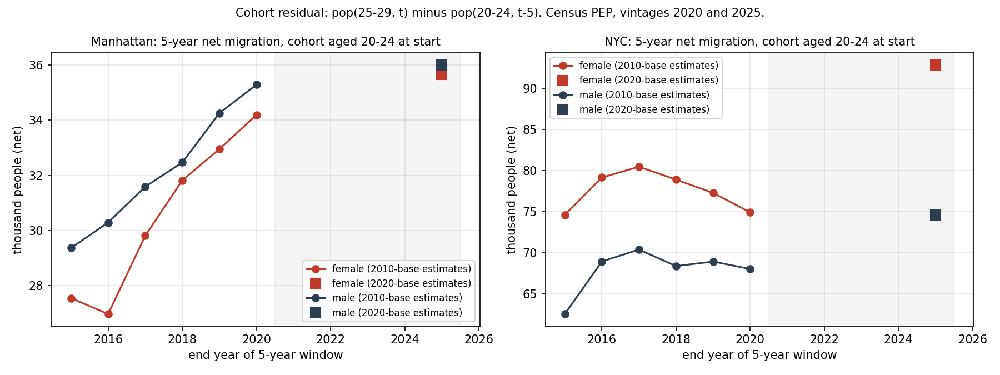
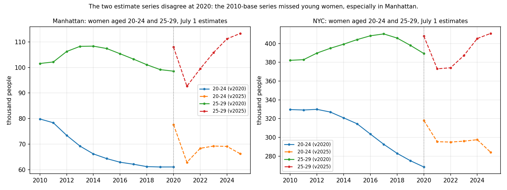
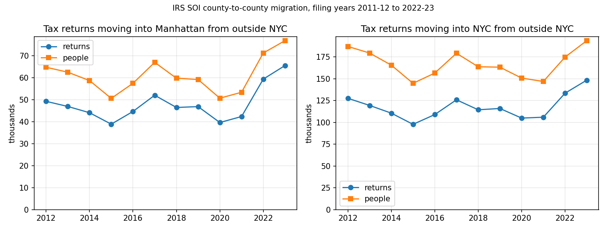
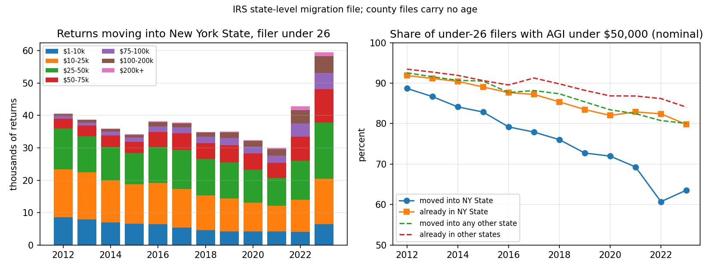

# Are fewer young people moving to New York?

Working repo for an article testing two claims: that fewer people in their twenties move to New York City (and Manhattan in particular) each year than in the early 2010s, and that the drop is concentrated among lower earners. Nothing here is settled. Two of the three planned sources are done: Census population estimates (net migration by age) and IRS tax-return address changes (gross arrivals by income).

So far: the Census estimates show the young-adult population of Manhattan growing by net migration at least as fast in the 2020s as in the 2010s. The IRS data shows arrivals into Manhattan and the city drifting down from 2012 to 2021, then jumping in 2022 and 2023, and shows the share of under-26 filers moving into New York State with AGI under $50,000 falling from 89% to 72% by 2020, against 92% to 82% for under-26 filers already living in the state. Wage growth explains the second drop; the extra 7 points in the first is arrivals getting richer than the people already here.

## Source 1: Census population estimates

The Census Bureau's county population estimates (PEP) give the population of each borough by age and sex every July. A group that is 20-24 in one year is 25-29 five years later, and almost nobody that age dies, so the change in that group's size is net migration. This is not survey-based, so it does not depend on young people answering the ACS.

Result: the estimates do **not** show fewer young adults arriving. For women aged 20-24 in Manhattan, net gain over the following five years:

| 5-year window | Net gain, women 20-24 at start | Series |
|---|---|---|
| 2010 to 2015 | +27,500 | 2010-base estimates |
| 2015 to 2020 | +34,200 | 2010-base estimates |
| 2020 to 2025 | +35,700 | 2020-base estimates |

Citywide the same window went from +74,600 to +74,900 to +92,800. Men look the same. Year by year since 2020, Manhattan gained 13,000 to 20,000 people aged 20-28 a year from 2022 to 2024 and 9,000 in 2025 (fig 2). The 2025 slowdown is one data point.



## Why this is not the end of the question

1. **The 2010s estimates missed young women in Manhattan.** The 2010-base series put women 20-24 in Manhattan at 61,100 in July 2020; the 2020 census-based series put the same group at 77,600, 27% higher (fig 3). The 2010s series was carried forward from the 2010 census with administrative data and drifted low. That means the 2010s cohort gains in the table above are probably *understated*, which would narrow the gap between then and now, not widen it. It also means the two series should not be joined into one line.
2. **The 2020 census itself had a college-age problem.** It was taken in April 2020, when students had left campuses. How the Bureau handled that affects the 2020-base series' starting point for exactly this age group.
3. **This is net, not gross.** More people arriving and more people leaving would look the same as no change. Only IRS flows and ACS can separate arrivals from departures.
4. **Nothing here says anything about income.** The low-earner claim needs IRS county-to-county flows by AGI band and ACS PUMS by personal income.



## Source 2: IRS tax-return address changes

The IRS Statistics of Income migration files count tax returns whose filing address moved from one county to another between two filing years, with the number of people on the return and the return's AGI. This is a count of arrivals, not net change, and it covers everyone who files, which is most adults but not students with no income or people paid off the books. The county files carry no age. The state files carry age of the filer and AGI band, so the age-by-income test can only be run for New York State as a whole.

Returns moving into Manhattan from outside the five boroughs, and into the five boroughs from outside the city:

| Filing year pair | Into Manhattan | Into NYC | Into NY State, filer under 26 | of which AGI under $50k |
|---|---|---|---|---|
| 2011-12 | 49,200 | 127,700 | 40,500 | 89% |
| 2014-15 | 38,900 | 97,800 | 34,300 | 83% |
| 2016-17 | 52,000 | 126,000 | 37,700 | 78% |
| 2019-20 | 39,600 | 105,000 | 32,400 | 72% |
| 2020-21 | 42,300 | 106,000 | 30,000 | 69% |
| 2021-22 | 59,300 | 133,500 | 42,900 | 61% |
| 2022-23 | 65,500 | 148,500 | 59,500 | 64% |

Full series in `output/tables/irs_inflows_manhattan_nyc.csv` and `output/tables/irs_ny_under26_by_agi.csv`.



Three things stop this from being an answer:

1. **2022-23 is a different series.** The IRS says that starting with the 2022-23 data it changed how it matches returns across years. Nationally, in-moving returns with a filer under 26 went from 690,000 in 2020-21 to 970,000 in 2022-23, a 40% jump that is not a real migration wave. The 2022-23 column should not be compared with earlier years, and 2021-22 is the first year of post-pandemic return, so the clean comparison is 2011-12 against 2019-20, the last pre-pandemic year: 20% fewer returns arriving in Manhattan, 18% fewer in the city, and 20% fewer under-26 filers arriving in the state.
2. **The AGI bands are in nominal dollars.** $50,000 in 2012 is about $66,000 in 2023 dollars, so a filer on the same real wage moved up roughly one band, and the IRS does not publish bands by age in constant dollars. The fix is to compare groups that faced the same inflation. Under-26 filers who already lived in New York went from 92% under $50k in 2012 to 82% in 2020; under-26 filers moving *into* New York went from 89% to 72%. The 10-point fall for residents is wages; the extra 7 points for arrivals is a change in who arrives. The same in-mover-minus-resident gap for every other state widened by only 2.5 points (93% to 83% for arrivals, 94% to 87% for residents), so this is a New York pattern, not a national one. In counts, under-26 arrivals to the state with AGI under $50k fell from 35,900 to 23,300 (35%) while all under-26 arrivals fell 20%. Table in `output/tables/irs_under26_low_agi_shares.csv`.
3. **Returns are not people, and filers are not the 20-28 cohort.** A return arriving in Manhattan carried 1.31 people in 2012 and 1.17 in 2023 (fig 4, gap between the lines), so the number of people arriving fell a little faster than the number of returns: 22% for Manhattan over 2012-2020 against 20% in returns. The under-26 age group is the filer's age, and dependents on a parent's return don't appear at all.



## Sources and files

| Source | Years | Age detail | File |
|---|---|---|---|
| PEP vintage 2020, county by age and sex | 2010-2020 | 5-year groups | `data/raw/CC-EST2020-AGESEX-36.csv` |
| PEP vintage 2025, county by age and sex | 2020-2025 | 5-year groups | `data/raw/CC-EST2025-AGESEX-36.csv` |
| PEP vintage 2025, county by single year of age and sex | 2020-2025 | single year | `data/raw/cc-est2025-syasex-36.csv` |

| IRS SOI county inflows | filing years 2011-12 to 2022-23 | none | `data/raw/irs/countyinflowYYYY.csv` |
| IRS SOI state inflows by AGI band and filer age | filing years 2011-12 to 2022-23 | under 26, 26-34, 35-44, ... | `data/raw/irs/YYYYinmigall.csv` |

Single year of age by county is not published for 2010-2019, in bulk files or the API (`pep/charage` stops at state level; `pep/charagegroups` gives counties in 5-year groups). So the annual series starts in 2021 and the 2010s rest on 5-year windows. The Census API key (`CENSUS_API_KEY`) is needed later for ACS PUMS.

## Run it

```
pip install -r requirements.txt
python src/fetch_pep.py       # downloads the three CSVs above (skips ones present)
python src/cohort_method.py   # writes data/processed/{levels,five_year_cohort,annual_cohort}.csv
python src/figures.py         # writes output/figures/fig1..fig3
python src/fetch_irs.py       # downloads 24 IRS CSVs into data/raw/irs (skips ones present)
python src/irs_flows.py       # writes data/processed/irs_*.csv, prints the tables above
python src/irs_figures.py     # writes output/figures/fig4..fig6 and output/tables/irs_*.csv
```

## Method notes

- `five_year_cohort.csv`: for each borough, NYC total, sex and start year, `net_migration = pop(next 5-year group, start+5) - pop(group, start)`. Computed within one estimate series only; no window straddles the 2020 break.
- `annual_cohort.csv`: for ages 20-28 in year t, `net = sum over a of pop(a, t) - pop(a-1, t-1)`. Single-year data, 2021-2025.
- Deaths are ignored. At ages 20-29 the death rate is roughly 1 per 1,000 a year, under 1% over five years.
- Year codes: vintage 2020 file, code 2 = July 2010 through code 12 = July 2020; vintage 2025 file, code 2 = July 2020 through code 7 = July 2025. Base-population rows (April 1) are dropped.
- `irs_county_inflows.csv`: for each borough, `inflow_returns` = the IRS "Total Migration-US and Foreign" row (`y1_statefips` 96) minus rows whose origin is one of the other four boroughs. NYC = sum of the five. A year label of 2023 means the 2022-23 file (address in filing year 2023 differs from filing year 2022). The 2020-21 and 2021-22 files ship FIPS codes without leading zeros; the parser pads them.
- `irs_ny_state_inflow_age_agi.csv`: New York State rows of the `inmigall` files, columns `inflow_n1_<age>` by `agi_stub`. Age code 1 = filer under 26, 2 = 26-34. AGI stubs: 1 = $1-10k, 2 = $10-25k, 3 = $25-50k, 4 = $50-75k, 5 = $75-100k, 6 = $100-200k, 7 = $200k+; stub 0 (all) also includes returns with AGI of zero or less.
- Mean AGI in `irs_county_inflows.csv` is deflated to 2023 dollars with annual CPI-U (fig 5). It is dominated by a small number of very high incomes and is not used in the write-up.

## Plan for the rest of the project

1. ACS 1-year PUMS, 2011-2024 (2025 due October 2026): people 20-28 who lived outside NYC a year earlier, by sex and personal income, with margins of error from replicate weights.
2. A table putting the three methods side by side, then the draft.
